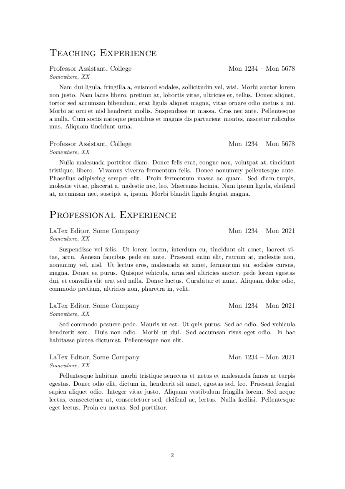
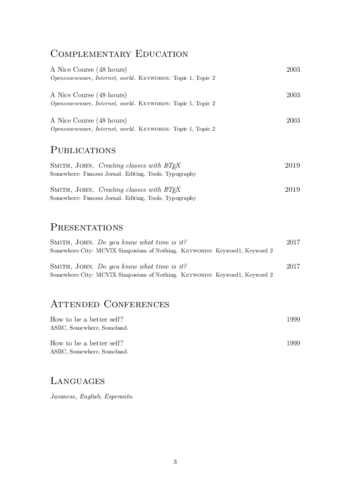

# elegantcv

A simple and elegant Curriculum Vitae. Works nice with LaTeX, XeTeX and LuaLaTex.

# Example







# To use

Put the `elegantcv.cls` and `icons` dir at same dir as your curriculum. Use `example-cv.tex` as an
example.

# To build the example

```
pdflatex example-cv.tex
```

And it will build the pdf file.

# Bugs


# Todo

A lot.

1. Add conditional formatting when some variables were not set (for example do not
display the phone entry if no phone is set.)

2. Adding some kind of flexibility for the contact. Displaying less or more information.

3. Be able to build CVs without the descriton (for resumes), how to do it?

4. Add a css configuration for `tex4ht`
